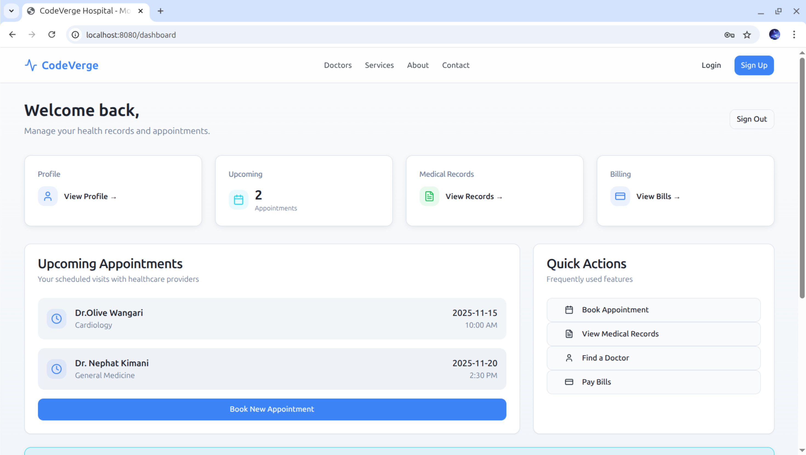
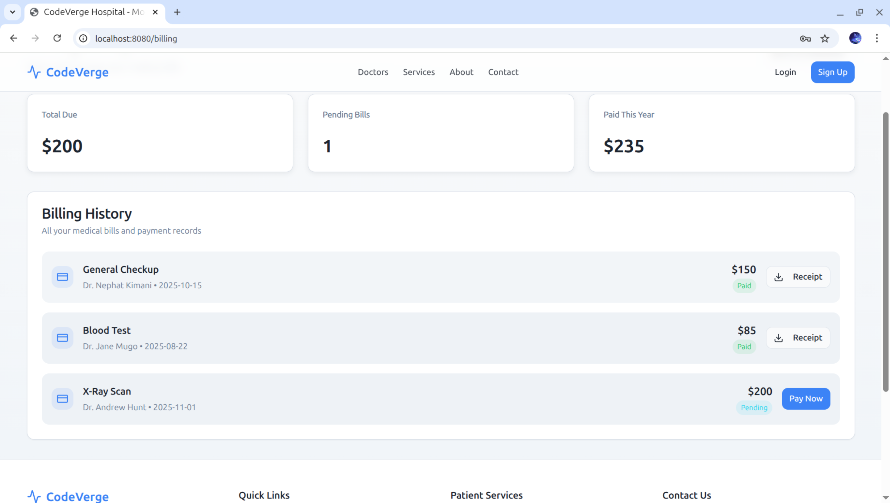
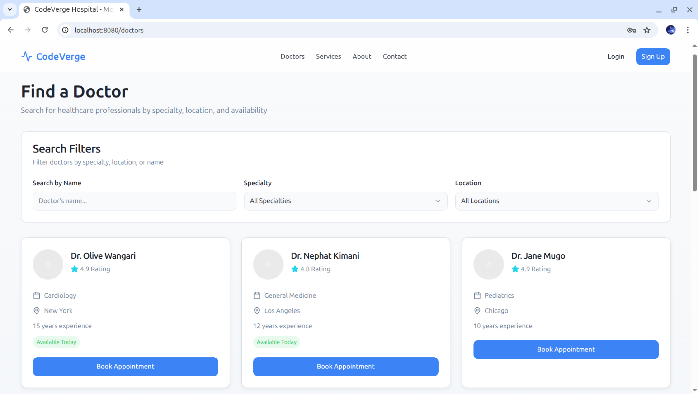
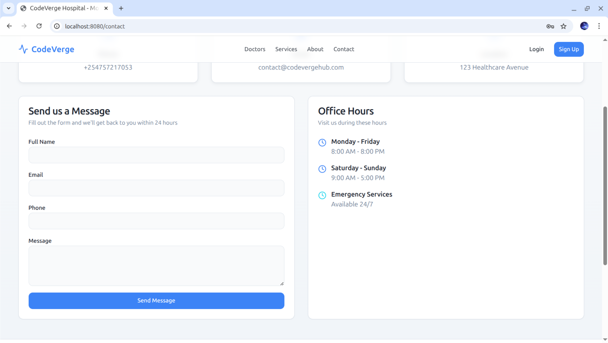
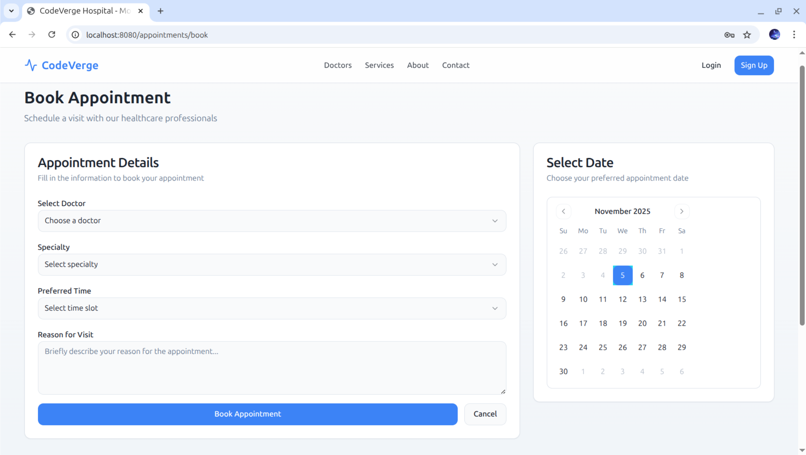
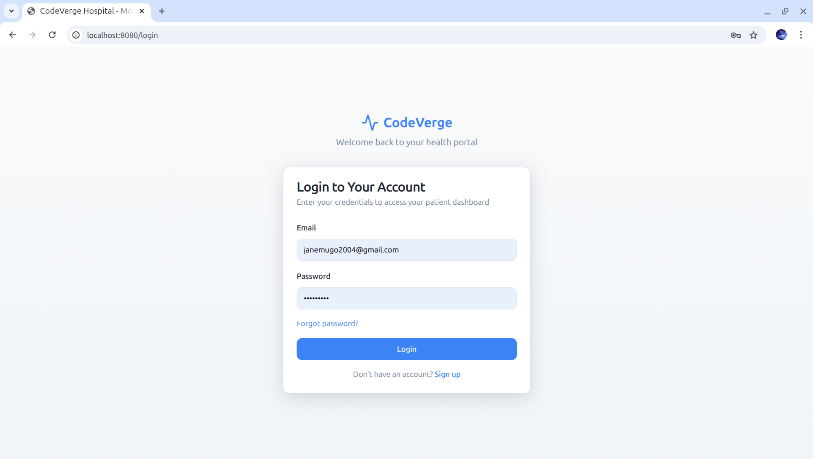
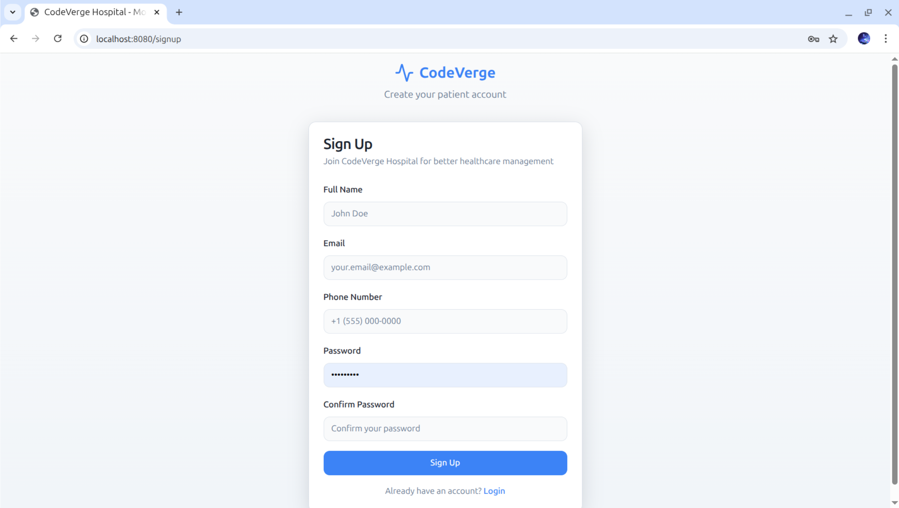
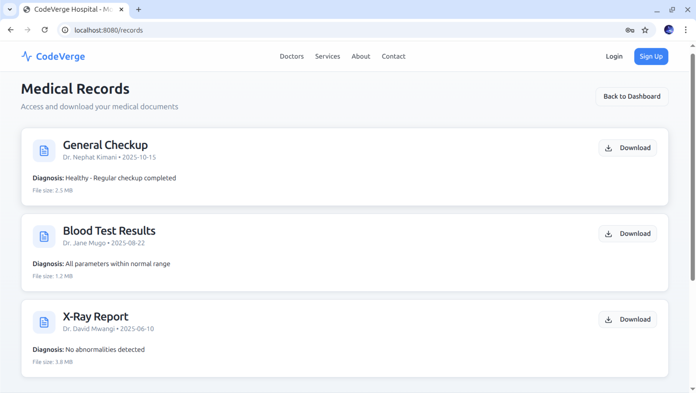
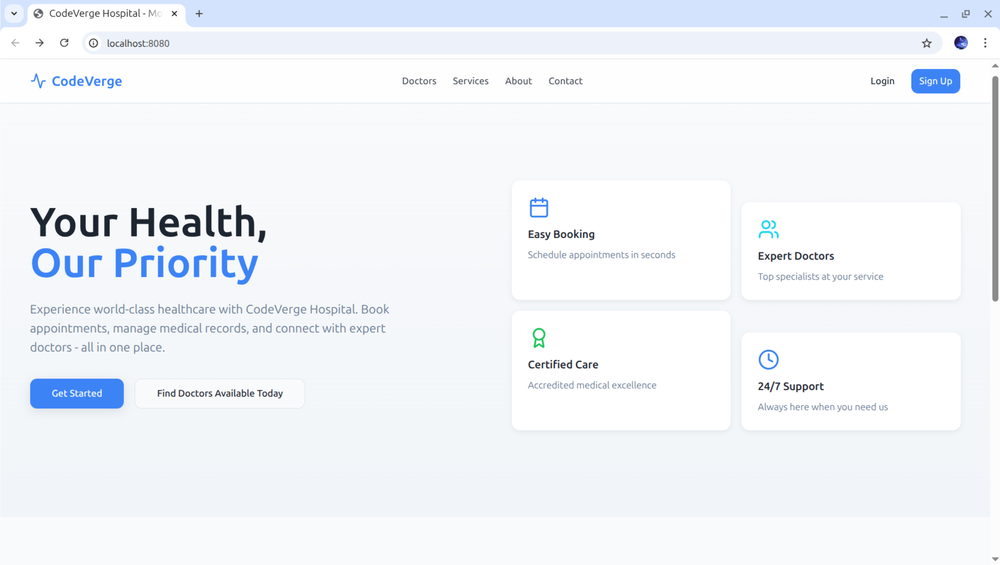

# CodeVerge Health 

A modern healthcare management system that enables patients to book appointments, manage medical records, and access healthcare services online.

## Features

-  **Patient Dashboard**
  - View upcoming appointments
  - Access medical records
  - Manage personal profile
  - Track billing and payments

- **Doctor Management**
  - Browse and search doctors by specialty
  - View doctor profiles and availability
  - Book appointments with preferred doctors

- **Medical Records**
  - Secure access to personal medical history
  - Download medical reports and test results
  - Track diagnoses and treatments

- **Billing & Payments**
  - View and pay medical bills
  - Download payment receipts
  - Track payment history

- **Smart Features**
  - Appointment reminders
  - Real-time notifications
  - Secure data encryption
  - 24/7 support access

## Tech Stack

- **Frontend Framework**: React with TypeScript
- **Build Tool**: Vite
- **UI Components**: shadcn/ui
- **Styling**: Tailwind CSS
- **State Management**: React Context
- **Routing**: React Router DOM
- **HTTP Client**: Tanstack Query
- **Form Handling**: React Hook Form
- **Notifications**: Sonner
- **Icons**: Lucide React

## Prerequisites

- Node.js (v16 or higher)
- npm or yarn package manager

## Installation

1. Clone the repository:
```bash
git clone https://github.com/JaneTheExplorer/CodeVerge.git
cd codeverge-healthhub

2. Install Dependencies:
npm install

3. Start the development server:
npm run dev

Then click Local: [http://localhost:8080/](http://localhost:3000/)


## Codeverge Screenshot View











##  Live Deployment

Check out the deployed version on Netlify: [codevergehub.netlify.app]


Developed by Jane Mugo, a full-stack developer focused on building robust, user-friendly web applications for real-world use.


